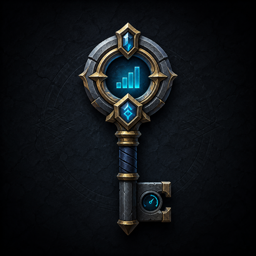

# Keystone Monitor

A compact, class-colored dungeon tracker for World of Warcraft that covers **every** 5-player dungeon mode — Follower, Normal, Heroic, Timewalking, Mythic 0, and Mythic+ — from classic dungeons all the way through Midnight content.

Keystone Monitor replaces the default objective tracker during dungeon runs with a clean, movable panel showing your timer, boss progress, enemy forces, deaths, and personal records, then gets out of your way when the run is over.



---

## Features

### Mythic+
- **Full keystone timer** with the +1 / +2 / +3 chest thresholds, including correct math when Challenger's Peril is active.
- **Pace hints** — a live readout of which chest level your current pace (elapsed time + death penalty) is tracking toward: `PACE: +3`, `PACE: +2`, `PACE: +1`, or `Overtime`.
- **Enemy forces bar** with exact count and percentage, marked `[Done]` with the completion timestamp once 100% is reached.
- **Deaths and time penalty** for the run, straight from the game's official death count.
- **Affix icons** with hover tooltips for the active keystone (or the current weekly affixes outside a run).
- **Best-time comparison** — pulls your best timed run for the current map from Blizzard's Mythic+ run history and shows a live delta against your current pace.
- **Boss objectives with kill times**, plus split deltas against your best recorded run (green = ahead, red = behind).
- **Automatic keystone insertion** — open the Font of Power and your keystone is slotted from your bags automatically (can be disabled).

### All other dungeon modes (Follower / Normal / Heroic / Timewalking / Mythic 0)
- **Boss roster detection** via the Encounter Journal the moment you zone in, so you can see every boss in the dungeon before you pull it.
- **Live boss progress** — bosses flip to `[Engaged]` when you pull them and `[Done]` with a clear time when they die, with a progress bar (`Bosses 2 / 4`).
- **Completion detection** — when the last boss dies the run is marked `COMPLETE` with your total clear time.
- **Personal best clear times** saved per dungeon and difficulty, with per-boss split deltas on future runs.
- **Death tracking** for the whole party, even though these modes have no built-in death counter.
- These modes have no dungeon timer, so no clock is shown by default. An optional **stopwatch** can be enabled for speedrunning (timing always runs silently in the background to power records and splits).

### Everywhere
- **Death log tooltip** — hover the Deaths line to see exactly who died and when, class-colored.
- **Run History tab** — three views built into the `/km` window: **Runs** (last 100 runs of any mode, with summary stats, All / Mythic+ / Dungeons filters, and per-run tooltips), **Best Timed** (highest keystone level timed per dungeon, with your best time at that level), and **Highest Key** (highest keystone level completed per dungeon, timed or not). The Best Timed and Highest Key views are drawn from your full Mythic+ run history for the season, covering every dungeon in the current pool even if you haven't logged a run for it yet. Open with `/km` or the watch button on the tracker.
- **Crash-proof runs** — an in-progress dungeon run survives `/reload`, disconnects, and briefly stepping out of the instance. Timer, boss kills, and deaths all restore automatically.
- **Objective tracker replacement** — Blizzard's quest tracker is hidden while a run is active and restored afterward.
- **Group Finder fill announcement** (optional, on by default) — if you're leading a group posted in Premade Groups and it fills to 5, Keystone Monitor prints a local chat line naming the keystone you're queued for (`Group Filled For +15 Operation: Mechagon`). An "Also broadcast to party chat" sub-option (off by default) sends the same message to party/raid chat so the whole group sees it.
- **Dungeon completion announcement** (optional, off by default) — when any tracked dungeon run finishes, posts a party/raid chat line with the clear time and death count: `Dungeon Timed in 24:15 - 2 deaths` (or `Dungeon Not Timed in ...` if the key wasn't timed) for Mythic+, `Dungeon Completed in ...` for every other mode.

## Performance

Keystone Monitor is built to be effectively invisible in your frame times:

- Timer text only redraws when the visible second changes — not every frame.
- Objective data only re-renders when something actually changed.
- Death tracking is event-driven (no combat log scanning — fully compatible with the Midnight combat log restrictions).
- Every text element skips redundant updates, and affix/tooltip data is cached.
- Event registration is dynamic: high-frequency events are only attached while a run is live.

## Installation

**CurseForge:** install "Keystone Monitor" from the CurseForge app or website.

**Manual:** download the release zip and extract it into your AddOns folder so it looks like:

```
World of Warcraft\_retail_\Interface\AddOns\KeystoneMonitor\KeystoneMonitor.toc
```

## Slash Commands

| Command | Effect |
|---|---|
| `/km` (or `/keystonemonitor`, `/mplus`) | Open the options window |
| `/km unlock` | Unlock the tracker so it can be dragged |
| `/km lock` | Lock the tracker in place |
| `/km show` | Show the tracker while unlocked |
| `/km hide` | Hide the tracker outside active runs |
| `/km reset` | Reset the tracker position |
| `/km resetrun` | Discard the saved snapshot for the current run and start tracking fresh |
| `/km debug` | Toggle mode-detection debug logging |
| `/km debug now` | Print a one-off mode-detection report |

## Options

The options window (`/km`) is organized into tabs:

- **General** — lock/unlock, visibility, best-timed comparison, pace hints, auto keystone insertion, the untimed-dungeon stopwatch, the Group Finder fill announcement, the dungeon completion announcement, tracked dungeon mode (Auto or force a specific mode), and preview scenarios for styling the tracker without being in a dungeon.
- **Run History** — Runs (your last 100 runs with summary stats, filters, and per-run tooltips), Best Timed (highest level timed per dungeon), and Highest Key (highest level completed per dungeon, timed or not).
- **Layout** — frame width/height, scale, and opacity.
- **Visual** — class-color accent or fully custom hex colors for every element (accent, background, border, text, timer, forces bar), with color pickers.
- **Fonts** — separate font choices for title, timer, and body text, plus a global font scale.
- **Profiles** — theme presets, and a compact export/import string so you can share your exact setup or move it between accounts.

## Saved Data

All settings and records live in `KeystoneMonitorDB` (account-wide SavedVariables):

- `profile` — appearance and behavior settings.
- `records` — best clear times and per-boss splits, keyed by dungeon and difficulty.
- `history` — your last 100 runs.
- `runtime` — the snapshot of an in-progress run (cleared automatically).

## Requirements

- World of Warcraft Retail, Interface `120007` (Midnight).
- No libraries or dependencies — the addon is fully self-contained.

## Project Structure

```
KeystoneMonitor.toc          Addon manifest
KeystoneMonitor.lua          Version stamp
src/Core/Core.lua            Lifecycle, mode sync, objective tracker hook
src/Core/Util.lua            Formatting and color helpers
src/Data/DB.lua              SavedVariables defaults and init
src/Runtime/State.lua        Run state, mode detection, scenario objectives
src/Runtime/Bosses.lua       Encounter Journal bosses, deaths, records, snapshots
src/Runtime/Splits.lua       Mythic+ run history and best-time comparisons
src/Runtime/Timer.lua        Update ticker
src/Runtime/Events.lua       Event registration and dispatch
src/UI/Render.lua            Tracker frame and rendering
src/UI/History.lua           Run History tab content
src/UI/Options.lua           Options window
src/UI/Commands.lua          Slash commands
```

## Issues & Questions

Found a bug or have a question? Join the [Discord](https://discord.gg/VhAj8K4C6F).

## Author

**Korivash**
